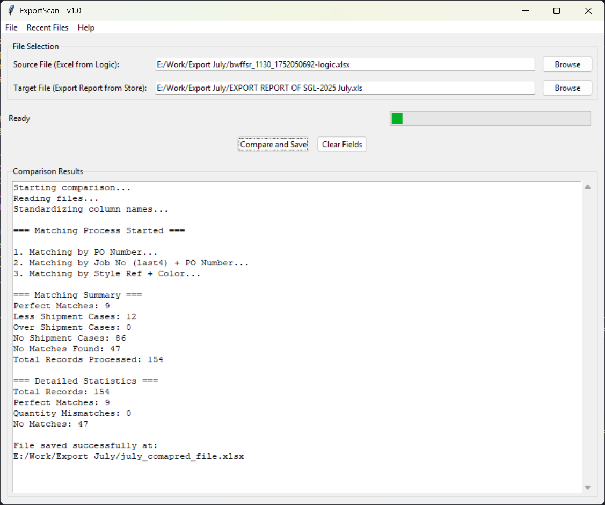

# ExportScan
A Python-powered tool to automate export data validation for garment manufacturing workflows.

## Purpose
I built this tool to save hours of manual work at my workplace (Southern Garments Ltd.) by automating the cross-checking of Logic export data vs. Store export data.
### Note: This is a personal project and not officially affiliated with Southern Garments Ltd. or Renaissance Group.

## Key Benefits
✔ Saves Hours – No more manual Excel comparisons!
✔ Reduces Errors – Automated checks minimize human mistakes.
✔ Fast & Efficient – Processes large datasets in seconds.
✔ Custom Matching Logic – Prioritizes PO, Job No., Style, and Color.

## Current Limitations
  Works best for buyers searchable by PO & Job No.
  Requires 3-4 months of Logic production data for accuracy.
  Needs manual Excel cleaning before processing.
  Only validates Logic vs. Store export data (no other reports).
  Most useful for large datasets (not small batches).

## Future Improvements
  Buyer-specific matching rules (custom conditions per buyer).
  Auto-clean & format data (reduce manual prep work).
  Smarter error detection (better comments & problem IDs).
  Expanded compatibility (more report types).
